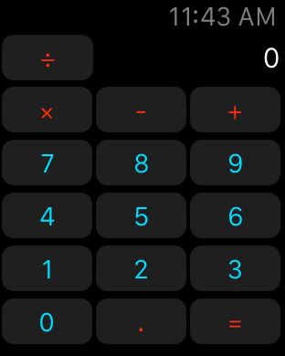
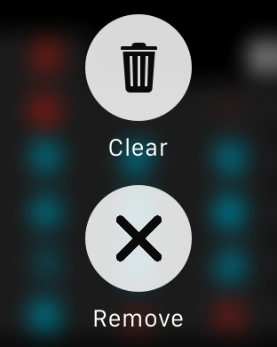

AppleWatchCalculator
====================

A calculator for your Apple Watch but only if you have fingers small enough to press the buttons.

A very simple calculator on your wrist with basic operations (+, -, *, /). Force Touch to show a menu and clear the screen or delete the last digit.
It was my first experiment to get my hands on WatchKit, and I was really impressed by how easy it is!

Have fun creating your watch apps! :)

<a href="http://www.twitter.com/BalestraPatrick" target="_blank">@BalestraPatrick</a>
